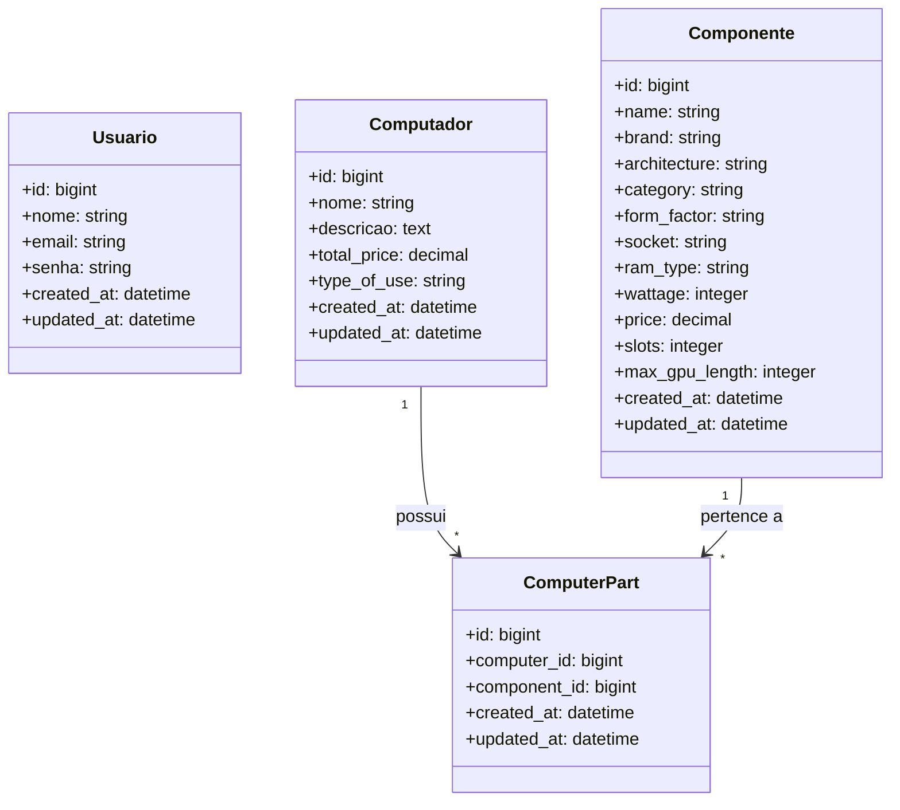

# Monte Seu PC

Aplicação Ruby on Rails para gerenciar computadores e seus componentes. O projeto permite cadastrar configurações de computadores, adicionar componentes e acompanhar o valor total do sistema.

## Funcionalidades

- Cadastro de computadores com nome, descrição, tipo de uso e preço total
- Registro de componentes com categoria, marca, arquitetura, preço e demais atributos
- Associação entre computadores e componentes via `computer_parts`
- Estrutura pensada para montar e consultar PCs personalizados

## Modelo de Dados

## Tecnologias

- Ruby 3.x
- Rails 8.1
- PostgreSQL
- Hotwire / Turbo / Stimulus via importmap

