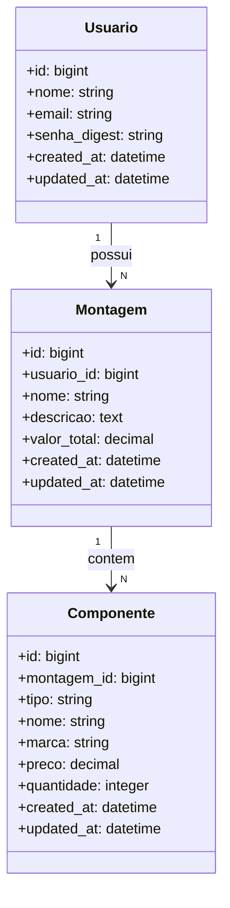

```mermaid
classDiagram
    class Usuario {
        +id: bigint
        +nome: string
        +email: string
        +senha_digest: string
        +created_at: datetime
        +updated_at: datetime
    }

    class Montagem {
        +id: bigint
        +usuario_id: bigint
        +nome: string
        +descricao: text
        +valor_total: decimal
        +created_at: datetime
        +updated_at: datetime
    }

    class Componente {
        +id: bigint
        +montagem_id: bigint
        +tipo: string
        +nome: string
        +marca: string
        +preco: decimal
        +quantidade: integer
        +created_at: datetime
        +updated_at: datetime
    }

    Usuario "1" --> "N" Montagem : possui
    Montagem "1" --> "N" Componente : contem
```

## Relacionamentos
- `Usuario` tem muitas `Montagens`
- `Montagem` pertence a `Usuario`
- `Montagem` tem muitos `Componentes`
- `Componente` pertence a `Montagem`