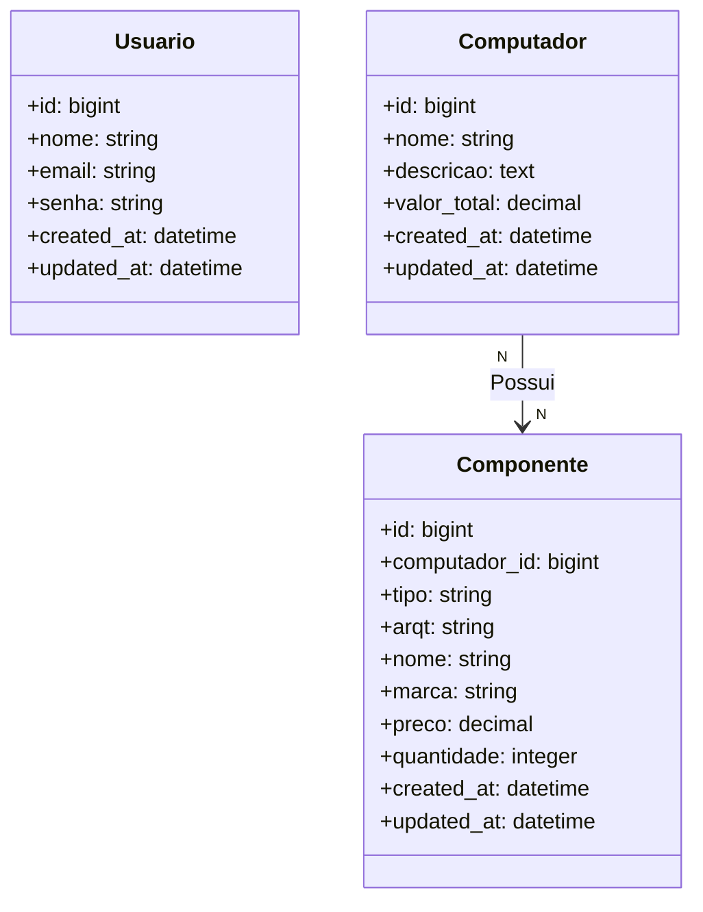

```mermaid
classDiagram
    class Usuario {
        +id: bigint
        +nome: string
        +email: string
        +senha: string
        +created_at: datetime
        +updated_at: datetime
    }

    class Computador {
        +id: bigint
        +nome: string
        +descricao: text
        +valor_total: decimal
        +created_at: datetime
        +updated_at: datetime
    }

    class Componente {
        +id: bigint
        +computador_id: bigint
        +tipo: string
        +arqt: string
        +nome: string
        +marca: string
        +preco: decimal
        +quantidade: integer
        +created_at: datetime
        +updated_at: datetime
    }


   
    Computador "N" --> "N" Componente : Possui  

```

