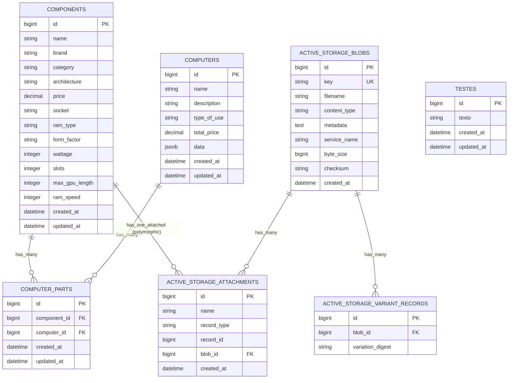

# Banco de Dados - Documentação

## Visão Geral

- **SGBD**: PostgreSQL (via `pg` gem)
- **ORM**: Active Record (Rails 8.1)
- **Schema**: `db/schema.rb` (versão 2026_06_07_185218)
- **Migrações**: 8 migrações aplicadas
- **Extensões**: `pg_catalog.plpgsql`
- **Active Storage**: Tabelas para upload de imagens de componentes

---

## Tabelas

### 1. `components` - Componentes de Hardware

Tabela principal que armazena todos os componentes (CPU, GPU, RAM, Motherboard, Storage, Power Supply, Case).

| Campo | Tipo | Nullable | Default | Descrição |
|-------|------|----------|---------|-----------|
| `id` | bigint | NOT NULL | PK auto | Chave primária |
| `name` | string | YES | - | Nome do componente |
| `brand` | string | YES | - | Marca (Intel, AMD, NVIDIA, Corsair, etc.) |
| `category` | string | YES | - | Categoria: "CPU", "GPU", "RAM", "MOTHERBOARD", "STORAGE", "SOURCE"/"POWER SUPPLY", "CASE" |
| `architecture` | string | YES | - | Arquitetura (ex: "Zen 4", "Raptor Lake", "Ada", "Ampere") |
| `price` | decimal(10,2) | YES | - | Preço em reais |
| `socket` | string | YES | - | Socket (CPUs e Motherboards) - ex: "LGA1700", "AM5" |
| `ram_type` | string | YES | - | Tipo de RAM (Motherboards e RAM) - ex: "DDR4", "DDR5" |
| `form_factor` | string | YES | - | Form factor (Motherboards: "ATX", "mATX"; Cases: "ATX", "mATX"; Storage: "M.2 NVMe", "3.5\" HDD") |
| `wattage` | integer | YES | - | Potência (PSUs em watts; GPUs em watts; CPUs em watts/TDP) |
| `slots` | integer | YES | - | Quantidade de slots (RAM: pentes; Motherboard: slots RAM) |
| `max_gpu_length` | integer | YES | - | Comprimento máximo GPU suportado (Cases em mm) |
| `ram_speed` | integer | YES | - | Velocidade RAM em MHz (CPUs: max suportada; RAM: velocidade; Motherboards: max suportada) |
| `created_at` | datetime | NOT NULL | - | Timestamp criação |
| `updated_at` | datetime | NOT NULL | - | Timestamp atualização |

**Índices**: Nenhum índice customizado (apenas PK)

**Constraints**: Nenhuma constraint de unicidade ou check constraints no banco

**Observações**:
- Campos específicos por categoria ficam NULL para outras categorias (modelo "wide table")
- `category` usa strings livres - sem ENUM no banco
- `ram_speed` foi migrado de string para integer (migração 20260607185218)
- Imagem armazenada via Active Storage (`has_one_attached :image`)

---

### 2. `computers` - Computadores Montados

Representa um build completo de PC.

| Campo | Tipo | Nullable | Default | Descrição |
|-------|------|----------|---------|-----------|
| `id` | bigint | NOT NULL | PK auto | Chave primária |
| `name` | string | YES | - | Nome do build (ex: "PC Gamer Budget") |
| `description` | string | YES | - | Descrição livre |
| `type_of_use` | string | YES | - | Tipo de uso: "Gaming", "Trabalho", "Estudo", etc. |
| `total_price` | decimal(10,2) | YES | - | Preço total calculado |
| `data` | jsonb | NOT NULL | `{}` | JSON flexível para armazenar specs por categoria (CPU, GPU, RAM, etc.) |
| `created_at` | datetime | NOT NULL | - | Timestamp criação |
| `updated_at` | datetime | NOT NULL | - | Timestamp atualização |

**Índices**: Nenhum índice customizado

**Normalização `total_price`**: No model `Computer`, há `normalizes :total_price` que remove "R$", espaços, pontos de milhar e troca vírgula por ponto antes de salvar.

**Campo `data` (JSONB)**: Estrutura esperada (baseado em `Computer#save_hash`):
```json
{
  "name": "PC Gamer Budget",
  "description": "Build entrada para gaming",
  "type_of_use": "Gaming",
  "total_price": "3500.00",
  "CPU": "AMD Ryzen 5 5600X",
  "MOTHERBOARD": "ASUS ROG STRIX B550-F",
  "GPU": "NVIDIA GeForce RTX 3060",
  "SOURCE": "Corsair CV650",
  "STORAGE": "Kingston A2000 500GB NVMe",
  "RAM": "Corsair Vengeance LPX 16GB DDR4"
}
```

---

### 3. `computer_parts` - Tabela de Junção (N:M)

Associa componentes a computadores (many-to-many).

| Campo | Tipo | Nullable | Default | Descrição |
|-------|------|----------|---------|-----------|
| `id` | bigint | NOT NULL | PK auto | Chave primária |
| `component_id` | bigint | NOT NULL | FK | Referência para `components.id` |
| `computer_id` | bigint | NOT NULL | FK | Referência para `computers.id` |
| `created_at` | datetime | NOT NULL | - | Timestamp criação |
| `updated_at` | datetime | NOT NULL | - | Timestamp atualização |

**Índices**:
- `index_computer_parts_on_component_id` (btree)
- `index_computer_parts_on_computer_id` (btree)

**Foreign Keys**:
- `fk_rails_...` → `components.id` (ON DELETE CASCADE via Rails dependent)
- `fk_rails_...` → `computers.id` (ON DELETE CASCADE via Rails dependent)

**Observações**:
- Não há constraint de unicidade `(computer_id, component_id)` - permite duplicatas
- Não há campo `quantity` - assume 1 unidade por linha
- `Computer` usa `has_many :computer_parts` + `has_many :components, through: :computer_parts`

---

### 4. Active Storage (Upload de Imagens)

Tabelas padrão do Rails Active Storage para anexar imagens aos componentes.

#### `active_storage_blobs`
| Campo | Tipo | Descrição |
|-------|------|-----------|
| `id` | bigint | PK |
| `key` | string | Chave única do blob (UUID) |
| `filename` | string | Nome original do arquivo |
| `content_type` | string | MIME type |
| `metadata` | text | Metadados (dimensões, etc.) |
| `service_name` | string | Nome do serviço de storage (local, s3, etc.) |
| `byte_size` | bigint | Tamanho em bytes |
| `checksum` | string | Checksum SHA256 |
| `created_at` | datetime | Timestamp |

**Índice único**: `index_active_storage_blobs_on_key`

#### `active_storage_attachments`
| Campo | Tipo | Descrição |
|-------|------|-----------|
| `id` | bigint | PK |
| `name` | string | Nome do attachment (ex: "image") |
| `record_type` | string | Classe do model (ex: "Component") |
| `record_id` | bigint | ID do record |
| `blob_id` | bigint | FK → `active_storage_blobs.id` |
| `created_at` | datetime | Timestamp |

**Índice único composto**: `(record_type, record_id, name, blob_id)`

#### `active_storage_variant_records`
| Campo | Tipo | Descrição |
|-------|------|-----------|
| `id` | bigint | PK |
| `blob_id` | bigint | FK → `active_storage_blobs.id` |
| `variation_digest` | string | Hash da transformação (resize, crop, etc.) |

**Índice único composto**: `(blob_id, variation_digest)`

---

### 5. `testes` - Tabela Órfã (Resíduo)

| Campo | Tipo | Descrição |
|-------|------|-----------|
| `id` | bigint | PK |
| `texto` | string | Campo genérico |
| `created_at` | datetime | Timestamp |
| `updated_at` | datetime | Timestamp |

**Observação**: Tabela sem modelo correspondente, provavelmente resíduo de desenvolvimento. Não identificado uso no código.

---

## Relacionamentos

### Diagrama Entidade-Relacionamento (Mermaid)



---

## Cardinalidade e Regras de Integridade

| Relacionamento | Cardinalidade | Integridade Referencial | Cascade Delete |
|----------------|---------------|------------------------|----------------|
| Computer → ComputerPart | 1:N | FK `computer_id` → `computers.id` | Sim (Rails `dependent: :destroy` implícito) |
| Component → ComputerPart | 1:N | FK `component_id` → `components.id` | Sim (Rails `dependent: :destroy` implícito) |
| Computer ↔ Component | N:M | Via `computer_parts` | N/A |
| Component → ActiveStorage::Attachment | 1:1 (polymorphic) | Polymorphic `record_id` + `record_type` | Sim (Rails) |
| ActiveStorage::Blob → Attachment | 1:N | FK `blob_id` | Sim (DB + Rails) |
| ActiveStorage::Blob → VariantRecord | 1:N | FK `blob_id` | Sim (DB + Rails) |

**Constraints em falta no banco**:
- ❌ Unique constraint em `computer_parts (computer_id, component_id)` - previne duplicatas
- ❌ Check constraint em `components.category` - valores válidos
- ❌ Check constraint em `components.price >= 0`
- ❌ Check constraint em `components.ram_speed > 0` quando presente
- ❌ Check constraint em `computers.total_price >= 0`
- ❌ Not null em `components.name`, `components.category`, `components.price`
- ❌ Not null em `computers.name`, `computers.total_price`

---

## Enums e Valores Controlados (Aplicação)

Não existem ENUMs no banco. Valores controlados apenas no código:

### `Component.category` (strings livres, seed usa):
| Valor | Descrição |
|-------|-----------|
| `"CPU"` | Processador |
| `"GPU"` | Placa de vídeo |
| `"RAM"` | Memória RAM |
| `"MOTHERBOARD"` | Placa-mãe |
| `"STORAGE"` | Armazenamento (SSD/HDD) |
| `"SOURCE"` / `"POWER SUPPLY"` | Fonte de alimentação (inconsistência no seed) |
| `"CASE"` | Gabinete |

### `Component.ram_type`:
- `"DDR4"`, `"DDR5"`

### `Component.form_factor` (varia por categoria):
- Motherboard: `"ATX"`, `"mATX"`, `"ITX"`, `"E-ATX"`
- Case: `"ATX"`, `"mATX"`, `"ITX"`
- Storage: `"M.2 NVMe"`, `"3.5\" HDD"`, `"2.5\" SSD"`

### `Component.socket`:
- Intel: `"LGA1700"`, `"LGA1200"`, etc.
- AMD: `"AM4"`, `"AM5"`, `"sTR5"`, etc.

### `Computer.type_of_use`:
- `"Gaming"`, `"Trabalho"`, `"Estudo"`, `"Design"`, etc. (livre)

---

## Fluxo das Entidades

### Criação de Componente (Admin/CRUD)
```
POST /components
  → ComponentsController#create
  → Component.new(component_params)
  → Component.save
  → ActiveRecord INSERT em `components`
  → Se image: Active Storage cria blob + attachment
```

### Montagem de Computador (Fluxo Principal)
```
1. Usuário acessa /components/select?category=CPU
   → ComponentsController#select_category
   → Renderiza grid de CPUs + stepper

2. Usuário clica em componente (Turbo Frame + Stimulus)
   → select_component_controller.js
   → Fetch Turbo Stream com selected_id
   → Atualiza preview lateral

3. Usuário clica "Avançar" → Próxima categoria (Motherboard)
   → Repete seleção por categoria (CPU → Motherboard → RAM → GPU → Storage → PSU → Case → Review)

4. Na etapa "Review": monta JSON com componentes selecionados
   → POST /computers (ou API)
   → ComputersController#create
   → Computer.new(computer_params)
   → Computer.save
   → Para cada componente: ComputerPart.create(computer_id, component_id)
   → Computer#create_mounting calcula total_price somando preços
```

### Validação de Compatibilidade (Automática)
```
Computer.save
  → validates :components, compatibility: true
  → CompatibilityValidator#validate_each
    → Busca motherboard, cpu, ram, case entre components
    → Verifica regras:
      • CPU.socket == Motherboard.socket
      • CPU.architecture == Motherboard.architecture
      • RAM.ram_type == Motherboard.ram_type
      • RAM.ram_speed <= CPU.ram_speed (CPU suporta velocidade da RAM)
      • Case.form_factor == Motherboard.form_factor
    → Adiciona errors[:base] se incompatível
    → Impede save se inválido
```

---

## Seeds (Dados Iniciais)

`db/seeds.rb` popula:
- **7 CPUs** (Intel LGA1700 + AMD AM4/AM5)
- **4 Motherboards** (LGA1700 ATX, AM5 ATX)
- **6 RAMs** (DDR4 3200/3600, DDR5 5600/6000/6400)
- **6 GPUs** (RTX 3060-4090, RX 6600-7700XT)
- **6 Storages** (NVMe 500GB-2TB, HDD 1-2TB)
- **4 PSUs** (550W-1000W)
- **6 Cases** (ATX/mATX, max GPU length 320-370mm)
- **3 Computers** vazios (Budget, Mid-Range, Workstation)

**Total**: 39 componentes + 3 computadores

---

## Observações Importantes

### Inconsistências Identificadas

| Item | Problema |
|------|----------|
| `SOURCE` vs `POWER SUPPLY` | Seed usa `"Power Supply"` mas validador e `save_hash` usam `"SOURCE"` |
| `category` case-sensitive | Seed: `"Motherboard"` (capitalized), Validador: `"MOTHERBOARD"` (upper) |
| `ram_speed` em CPU vs RAM | CPU tem `ram_speed` (max suportada), RAM tem `ram_speed` (velocidade real) - mesmo nome, semântica diferente |
| `architecture` em CPU vs GPU | CPU: "Zen 4", "Raptor Lake"; GPU: "Ada", "Ampere", "RDNA 3" - domínios diferentes no mesmo campo |
| `wattage` em CPU vs GPU vs PSU | CPU: TDP (65-170W); GPU: TGP (150-450W); PSU: Capacidade (550-1000W) - mesmo campo, unidades/escala diferentes |

### Performance / Índices Faltantes

```sql
-- Recomendados para queries frequentes:
CREATE INDEX idx_components_category ON components(category);
CREATE INDEX idx_components_category_brand ON components(category, brand);
CREATE INDEX idx_components_category_price ON components(category, price);
CREATE INDEX idx_computer_parts_computer_id ON computer_parts(computer_id);
CREATE INDEX idx_computer_parts_component_id ON computer_parts(component_id);
CREATE UNIQUE INDEX uq_computer_parts_computer_component ON computer_parts(computer_id, component_id);
```

### Migrações Pendentes / Sugeridas

1. Adicionar `NOT NULL` + `CHECK` constraints em campos obrigatórios
2. Criar ENUM type para `component.category` no PostgreSQL
3. Separar campos específicos por categoria em tabelas filhas (STI ou tabelas separadas)
4. Adicionar `quantity` em `computer_parts`
5. Remover tabela `testes`

---

## Queries Comuns

### Componentes por categoria com filtros (ComponentsController#index)
```sql
SELECT * FROM components
WHERE category = 'CPU'
  AND brand = 'Intel'
  AND price BETWEEN 500 AND 2000
ORDER BY price ASC
LIMIT 8 OFFSET 0;
```

### Computador com componentes (N+1 risk)
```sql
-- Computer.includes(:components)
SELECT * FROM computers WHERE id = 1;
SELECT * FROM components
INNER JOIN computer_parts ON components.id = computer_parts.component_id
WHERE computer_parts.computer_id = 1;
```

### Validação de compatibilidade (CompatibilityValidator)
```sql
-- 4 queries separadas por validação (N+1 no loop)
SELECT * FROM components
INNER JOIN computer_parts ON ...
WHERE computer_parts.computer_id = 1 AND category = 'MOTHERBOARD' LIMIT 1;
-- Repete para CPU, RAM, CASE
```

---

## Backup / Restore

```bash
# Dump schema + data
pg_dump -h localhost -U postgres -d monte_seu_pc_development > backup.sql

# Restore
psql -h localhost -U postgres -d monte_seu_pc_development < backup.sql

# Rails way
bin/rails db:schema:dump
bin/rails db:schema:load
```

---

*Documento gerado em 2026-07-22 baseado no estado atual do código (schema.rb v2026_06_07_185218)*